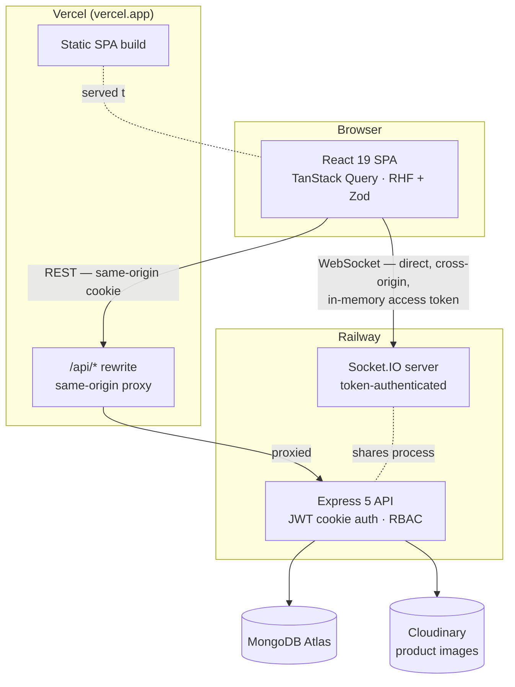
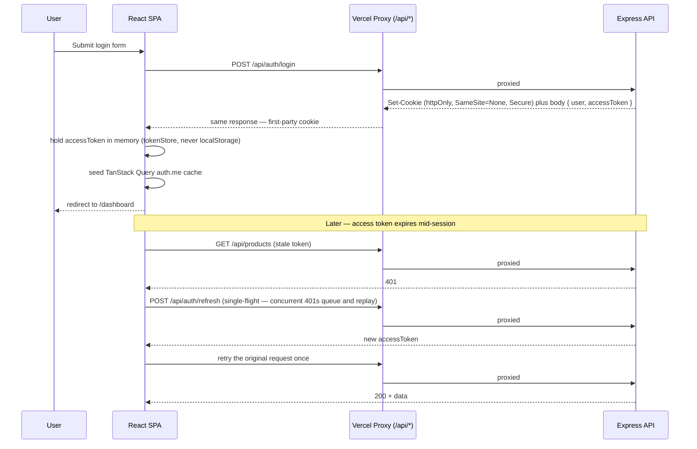

# Mini ERP — Inventory & Sales Management (Frontend)


A role-aware, real-time inventory and sales SPA built for a Full-Stack MERN
developer technical assessment (Classic IT & Sky Mart Ltd., Uttara, Dhaka).

This is the **client**. It talks to a companion Express/MongoDB API — see
[`mini-erp-server`](https://github.com/mahmud035/mini-erp-server) for the backend
case study (dynamic RBAC engine, transactional sales, Socket.IO alerts).

**Live app:** https://mini-erp-client-app.vercel.app

**Live API:** https://mini-erp-server.up.railway.app/api/health

Every claim below matches the deployed build — nothing here is aspirational.

---

## For recruiters — 60-second overview

|                             |                                                                                                                                                                                                 |
| --------------------------- | ----------------------------------------------------------------------------------------------------------------------------------------------------------------------------------------------- |
| **Brief**                   | Build an Inventory & Sales Mini ERP: products, customers, sales, dashboard, role-based access.                                                                                                  |
| **Differentiators shipped** | Dynamic (DB-driven) RBAC, all-or-nothing transactional sales, live Socket.IO low-stock alerts, Cloudinary image pipeline, generic paginated/search list contract shared by every list endpoint. |
| **Stack**                   | React 19 · TypeScript (strict) · Vite 8 · Tailwind CSS v4 · ShadCN · TanStack Query v5 · React Hook Form + Zod v4 · Socket.IO client                                                            |
| **Deployed**                | Vercel (client) + Railway (API) + MongoDB Atlas + Cloudinary — cross-origin cookie auth solved via a same-origin proxy (details below).                                                         |
| **Try it**                  | Log in with any of the three seeded roles below and compare what each can see and do.                                                                                                           |

### Demo credentials (all: `Password123!`)

| Role     | Email               | Can do                                                                                                                                            |
| -------- | ------------------- | ------------------------------------------------------------------------------------------------------------------------------------------------- |
| Admin    | `admin@erp.test`    | Everything below, plus user/role management on the backend (no admin UI in this build — see [Scope cuts](#scope-cuts-documented-not-oversights)). |
| Manager  | `manager@erp.test`  | Full product CRUD, record sales, view dashboard.                                                                                                  |
| Employee | `employee@erp.test` | Read-only products, record sales, view dashboard. No create/edit/delete buttons render.                                                           |

Log in as `employee@erp.test` first, then `admin@erp.test` — the UI itself is the
proof that permissions are enforced, not just hidden.

---

## Table of contents

- [Features](#features)
- [Architecture](#architecture)
- [Authentication deep dive](#authentication-deep-dive)
- [Permission matrix](#permission-matrix)
- [Tech stack](#tech-stack)
- [Project structure](#project-structure)
- [Getting started](#getting-started)
- [Environment variables](#environment-variables)
- [Available scripts](#available-scripts)
- [API contract](#api-contract)
- [Quality gates](#quality-gates)
- [Known issues](#known-issues)
- [Scope cuts (documented, not oversights)](#scope-cuts-documented-not-oversights)
- [Roadmap](#roadmap)
- [Author](#author)

---

## Features

### Dashboard

Aggregate stat cards (products, customers, sales) plus a live low-stock table,
all from a single `GET /dashboard` call. Explicit skeleton, error+retry, and
loaded states — never a blank screen.

### Products (full CRUD, permission-gated)

- Debounced (400ms) search across name/SKU/category, numbered pagination,
  `keepPreviousData` so pages don't flash empty while the next one loads.
- Create/edit via a single modal `Dialog`, `multipart/form-data` submit.
- Image is **required on create**, optional on edit (keeps the existing
  Cloudinary asset if omitted). Local `URL.createObjectURL` preview, revoked on
  replace/unmount — no leaked blob URLs.
- Duplicate SKU → the API's `409` maps to an inline field error on `sku`, not a
  generic toast.
- Delete behind a confirm `AlertDialog`.
- Every write action (`Add product`, edit pencil, delete icon) is gated by
  `can('product:create' | 'update' | 'delete')` — an Employee sees a read-only
  table with no action column at all.

### New Sale (the differentiator)

- Customer dropdown + dynamic product line items (`useFieldArray`).
- **Live advisory total**, computed client-side from the loaded product list,
  recalculated on every keystroke via `useWatch`.
- Per-line "only N in stock" warning the moment a quantity would exceed known
  stock — submit button disables itself.
- The advisory total is exactly that: **the server is the source of truth**.
  `grandTotal` in the response always wins and is what's shown in the success
  banner, because the server holds a DB transaction lock the browser can't see.
- A submit that fails a transactional stock check server-side surfaces the
  API's own abort message verbatim — never a hardcoded string.

### Real-time low-stock alerts

A `Socket.IO` connection (direct to the Railway origin — see
[Authentication deep dive](#authentication-deep-dive) for why) pushes a
`low-stock-alert` event to anyone in the permission-gated `inventory` room the
moment a sale drops a product below threshold. One grouped toast per event,
not one per product.

### Role-aware navigation

The navbar itself is permission-driven — `New Sale` doesn't appear for a role
without `sale:create`. Route guards handle the session (`ProtectedRoute`);
permission checks (`can()`) handle _what inside the app_ is visible.

---

## Architecture



**Feature-driven, mirrors the backend 1:1.** Pages orchestrate (data fetching,
loading/error/empty branching); features execute (API calls, hooks,
domain components). No cross-feature imports — anything two features need
gets promoted to `components/ui/`, `hooks/`, or `utils/` first, so `sale/` has
zero import path into `product/` even though a sale is built from products.

| Layer            | Owns                                                     | Never does                          |
| ---------------- | -------------------------------------------------------- | ----------------------------------- |
| `pages/`         | Route-level orchestration, loading/error/empty branching | Business logic, direct API calls    |
| `features/*`     | API calls, TanStack Query hooks, Zod schemas, domain UI  | Reach into another feature's folder |
| `components/ui/` | Dumb, reusable, presentational primitives (ShadCN)       | Business logic, data fetching       |
| `providers/`     | App-wide singletons: Query client, Socket lifecycle      | Route-level UI                      |

---

## Authentication deep dive

The Vercel and Railway deployments are **different registrable domains**, so a
plain cross-site cookie would be blocked as third-party by the browser. That's
the actual production constraint this project solved — not a toy problem.

**Solution: same-origin proxy.** `vercel.json` rewrites `/api/*` to the Railway
origin, so the browser only ever talks to `*.vercel.app`. The auth cookie is
issued and read as **first-party**. `vite.config.ts` mirrors the same proxy in
dev so `localhost` behaves identically to production.



Three details worth a reviewer's attention:

1. **Single-flight refresh.** If five requests 401 at once, only the first
   fires `/auth/refresh`; the other four park in a `waiters[]` queue and
   replay once it resolves — no refresh stampede.
2. **`/auth/login` and `/auth/refresh` are excluded from the interceptor**
   (`isAuthEndpoint`), or a failed refresh would recursively trigger itself.
3. **The socket problem.** WebSockets can't ride an HTTP rewrite, and the
   httpOnly cookie isn't readable cross-site by JS. So login/refresh _also_
   return an `accessToken` in the response body, held in memory only
   (`utils/tokenStore.ts`) and handed to the socket handshake as
   `auth: (cb) => cb({ token })`. The cookie authenticates REST; the in-memory
   token authenticates the one thing the cookie can't reach.
4. **Auth-loss bridge.** When a refresh finally fails, axios dispatches a
   `window` event; `QueryProvider` sets the cached `auth.me` query to `null`
   directly. Using `queryClient.clear()` here was tried first and caused a
   refetch loop — a real bug this design fixes, not a hypothetical.

---

## Permission matrix

Permissions are resolved **per request from the database** on the backend — a
role's permissions change without a redeploy. The frontend never hardcodes a
role name; every gate is `can('resource:action')` against the permission
array on the logged-in user.

| Permission          | Admin | Manager | Employee | Gates in this UI                                                                     |
| ------------------- | :---: | :-----: | :------: | ------------------------------------------------------------------------------------ |
| `product:read`      |  ✅   |   ✅    |    ✅    | Products table visible to all authenticated roles                                    |
| `product:create`    |  ✅   |   ✅    |    ❌    | `Add product` button                                                                 |
| `product:update`    |  ✅   |   ✅    |    ❌    | Edit (pencil) icon per row                                                           |
| `product:delete`    |  ✅   |   ✅    |    ❌    | Delete (trash) icon per row                                                          |
| `customer:read`     |  ✅   |   ✅    |    ✅    | Customer picker on the New Sale form (the intentional "seam")                        |
| `sale:create`       |  ✅   |   ✅    |    ✅    | `New Sale` nav link + form submit                                                    |
| `dashboard:read`    |  ✅   |   ✅    |    ✅    | Dashboard page                                                                       |
| `user:*` / `role:*` |  ✅   |   ❌    |    ❌    | Backend-only in this build — see [Scope cuts](#scope-cuts-documented-not-oversights) |

---

## Tech stack

| Concern        | Choice                                                                                      |
| -------------- | ------------------------------------------------------------------------------------------- |
| UI library     | React 19                                                                                    |
| Language       | TypeScript (strict, `verbatimModuleSyntax`, `noUnusedLocals/Parameters`)                    |
| Build tool     | Vite 8 (requires Node 20.19+ or 22.12+)                                                     |
| Styling        | Tailwind CSS v4 (semantic tokens) + ShadCN (radix-nova style)                               |
| Server state   | TanStack Query v5 (`keepPreviousData`, single stable client)                                |
| HTTP client    | Axios (single instance, `withCredentials: true`, refresh interceptor)                       |
| Forms          | React Hook Form + Zod v4 (custom lightweight resolver, no `@hookform/resolvers` dependency) |
| Routing        | React Router v7 (`createBrowserRouter`)                                                     |
| Realtime       | socket.io-client 4.8.3                                                                      |
| Icons          | lucide-react                                                                                |
| Toasts         | Sonner                                                                                      |
| Linting/format | ESLint 10 (flat config) + Prettier 3                                                        |

---

## Project structure

```
src/
├── api/                # Axios instance, refresh interceptor, socket client, shared response types
├── components/
│   ├── layout/          # AppLayout (navbar shell), ProtectedRoute (session guard)
│   └── ui/               # ShadCN primitives — presentational only
├── features/             # Domain modules, 1:1 with backend resources
│   ├── auth/              # login, logout, /me, useAuth()/can()
│   ├── dashboard/         # stats + low-stock aggregate
│   ├── product/           # CRUD, image upload, search+pagination
│   └── sale/              # customer/product pickers, sale creation
├── hooks/                # useDebounce — extracted only because 2+ features need it
├── pages/                # Route-level orchestration only
├── providers/            # QueryProvider (TanStack Query + auth-loss bridge), SocketProvider
├── routes/               # router.tsx — the route table
└── utils/                # cn, tokenStore (in-memory access token), zodResolver
```

Each feature module keeps the same four files: `*.api.ts` (Axios calls),
`*.hooks.ts` (TanStack Query), `*.validation.ts` (Zod), `components/` (domain
UI). `auth` and `dashboard` have no `.validation.ts` — they don't own a form.

---

## Getting started

### Prerequisites

- Node.js **20.19+ or 22.12+** (Vite 8's floor — built and verified on Node
  v24.17.0 to match the backend's pin)
- npm (project uses `package-lock.json`)
- A running instance of the [backend API](https://github.com/mahmud035/mini-erp-server)
  — locally or the deployed Railway instance

### Local setup

```bash
git clone https://github.com/mahmud035/mini-erp-client.git
cd mini-erp-client
npm install
cp .env.example .env   # defaults already point at the live Railway API
npm run dev
```

The app runs at `http://localhost:5173`. By default `.env` points
`VITE_DEV_PROXY_TARGET` and `VITE_SOCKET_URL` at the **live Railway backend**,
so you get a fully working app with zero backend setup. To run against a
local backend instead, override `VITE_DEV_PROXY_TARGET` and `VITE_SOCKET_URL`
in `.env` to `http://localhost:<backend-port>`.

### Production build

```bash
npm run build      # tsc -b && vite build
npm run preview     # serve the production build locally
```

---

## Environment variables

| Variable                | Used where                        | Example / default                        | Notes                                                                                                                                                                   |
| ----------------------- | --------------------------------- | ---------------------------------------- | ----------------------------------------------------------------------------------------------------------------------------------------------------------------------- |
| `VITE_API_URL`          | Axios `baseURL`                   | `/api`                                   | Always same-origin — the Vercel rewrite (prod) or Vite proxy (dev) resolves it. Never point this at a raw cross-origin URL; the cookie would be blocked as third-party. |
| `VITE_DEV_PROXY_TARGET` | `vite.config.ts` dev server proxy | `https://mini-erp-server.up.railway.app` | Dev-only. Mirrors the prod `vercel.json` rewrite so `localhost` gets first-party cookies too.                                                                           |
| `VITE_SOCKET_URL`       | `src/api/socket.ts`               | `https://mini-erp-server.up.railway.app` | Raw origin, **no** `/api` suffix — WebSockets connect direct, not through the rewrite. Must match the same value set in Vercel's project env for prod.                  |

---

## Available scripts

| Script                            | Does                                                             |
| --------------------------------- | ---------------------------------------------------------------- |
| `npm run dev`                     | Vite dev server with the API proxy                               |
| `npm run build`                   | Type-checks (`tsc -b`) then builds — must be clean, no `--force` |
| `npm run typecheck`               | `tsc --noEmit -p tsconfig.app.json`                              |
| `npm run lint`                    | ESLint, flat config                                              |
| `npm run format` / `format:check` | Prettier write / verify                                          |
| `npm run preview`                 | Serve the production build locally                               |

---

## API contract

Every endpoint returns the same envelope; the frontend types mirror it so a
backend contract change breaks TypeScript at **compile time**, not runtime:

```ts
interface ApiResponse<T> {
  statusCode: number
  success: boolean
  message: string
  data: T
}
```

Paginated/searchable lists (products, customers) share one generic shape from
the backend's `QueryBuilder`:

```ts
interface Paginated<T> {
  items: T[]
  pagination: { page: number; limit: number; total: number; totalPages: number }
}
```

Full endpoint reference and a Postman collection live in the
[backend repo](https://github.com/mahmud035/mini-erp-server).

---

## Quality gates

- `npm run build`, `npm run typecheck`, and `npm run lint` are clean on every
  commit — no `@ts-ignore`, no disabled ESLint rules.
- Cookie auth, multipart image upload, and the Socket.IO handshake **cannot be
  exercised by a static sandbox** (they need a real browser with cookies and a
  live WebSocket). Those flows were smoke-tested locally and against the live
  Vercel + Railway deployment before each batch was marked done — e.g., create
  product with image → 201 + thumbnail renders live; duplicate SKU → inline
  `409`; employee login → zero write buttons render; low-stock sale → toast
  fires within the same session.

---

## Known issues

**`id` vs `_id` inconsistency.** Auth/user responses are serialized
(`toUserResponse` → `id`); product and customer responses return the raw
Mongoose document (`_id`). The frontend types this explicitly rather than
papering over it (`User.id` vs `Product._id`), so it's a visible, intentional
type distinction — not a bug — but it is inconsistent API design. Documented
fix, not applied pre-deadline: add a product/customer serializer that exposes
`id` like auth does.

## Scope cuts (documented, not oversights)

Given the assessment's time box, the following were consciously **not**
built, in favor of a clean, fully-working core over a padded feature list:

- No dynamic-RBAC admin UI (role/permission management is a backend-only
  capability in this build — proven via `curl`/Postman, not wired to a
  screen).
- No sales-history page (sale creation is built and gated; browsing past
  sales was cut).
- No product detail page, no column-sort UI, no animations.

## Roadmap

- Product/customer response serializer to resolve the `id`/`_id` inconsistency.
- Sales-history page with date-range filtering.
- Minimal RBAC admin screen (role → permission assignment) surfaced from the
  existing backend endpoints.

---

## Author

**Mahmud** — Full-Stack Developer
GitHub: [@mahmud035](https://github.com/mahmud035)

Built end-to-end (schema → API → deploy → UI) as a technical assessment.

Licensed under [MIT](./LICENSE).
